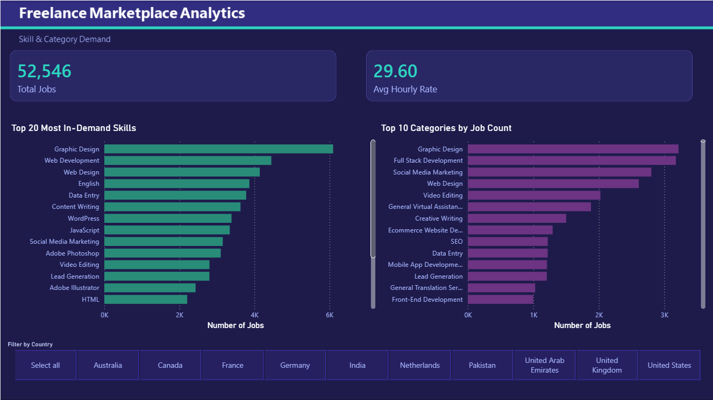
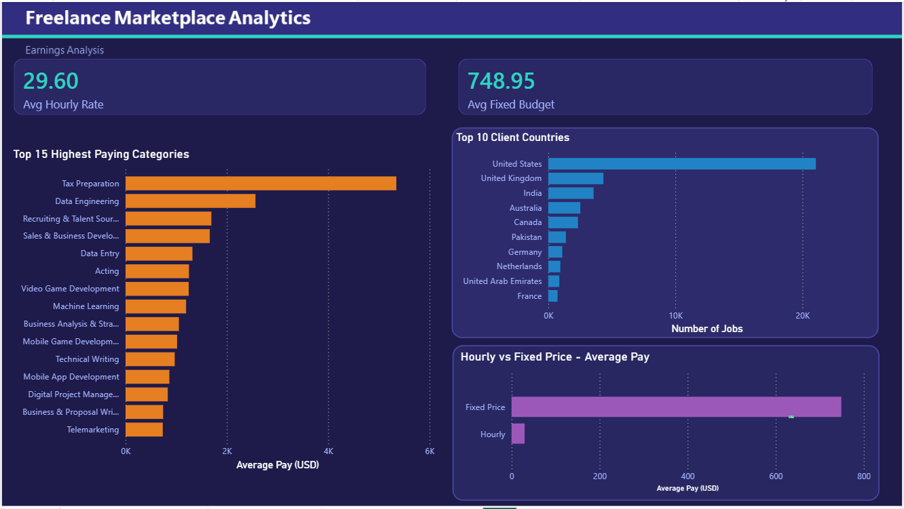
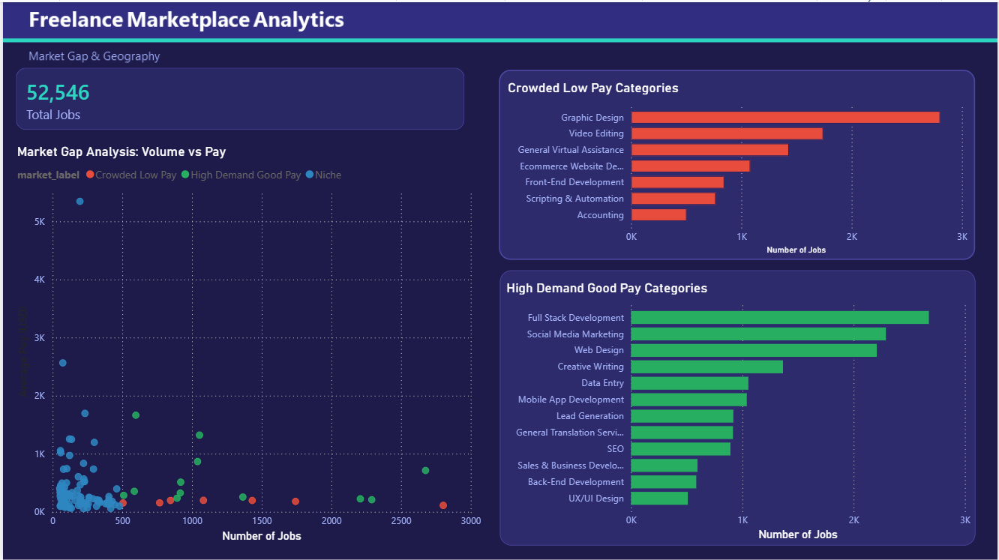

# Freelance Marketplace Analytics

A data analytics project built to explore the Upwork gig economy — what skills are in demand, which categories pay well, and where the market is overcrowded.

Built using **PostgreSQL**, **Power BI**, and **DAX** as a portfolio project for internship applications.

---

## What This Project Is About

I took a dataset of 53,000+ Upwork job postings from 2024 and tried to answer five real questions a freelancer or recruiter might actually care about:

1. Which skills are employers hiring for the most?
2. Which job categories pay the highest?
3. Do hourly jobs or fixed price jobs pay better?
4. Which countries are posting the most jobs?
5. Where is the market overcrowded with low pay? (market gap analysis)

---

## Dashboard Preview

**Page 1 — Skill & Category Demand**

**Page 2 — Earnings Analysis**

**Page 3 — Market Gap & Geography**

---

## Key Findings

| Question | Finding |
|---|---|
| Most in-demand skill | Graphic Design — 6,097 jobs |
| Highest paying category | Tax Preparation — $5,344 avg |
| Hourly vs Fixed | Fixed pays more on average ($748 vs $29/hr) |
| Biggest client country | United States — 40.96% of all jobs |
| Most crowded low pay | Graphic Design — 2,803 jobs at only $109 avg |

---

## Tools Used

| Tool | Purpose |
|---|---|
| PostgreSQL | Data cleaning and analysis |
| Power BI | Dashboard and visualizations |
| Power Query | Data type fixes |
| DAX | KPI measures |

---

## How the Data Was Cleaned

The raw dataset had category and skills buried inside a long description text field — not in separate columns. I extracted them using SQL string functions, cast all columns to proper types, and created a unified `avg_rate` column that works for both hourly and fixed price jobs.

Raw table → 53,058 rows  
Clean table → 52,546 rows

---

## Files in This Repo

| File | What it is |
|---|---|
| `freelance_analytics.sql` | All SQL — table creation, cleaning, analysis queries |
| `page1_skill_demand.png` | Dashboard Page 1 screenshot |
| `page2_earnings.png` | Dashboard Page 2 screenshot |
| `page3_market_gap.png` | Dashboard Page 3 screenshot |

---

## Dataset

Source: [Upwork Job Postings 2024 — Kaggle](https://www.kaggle.com/)  
Rows: 53,058 job postings
